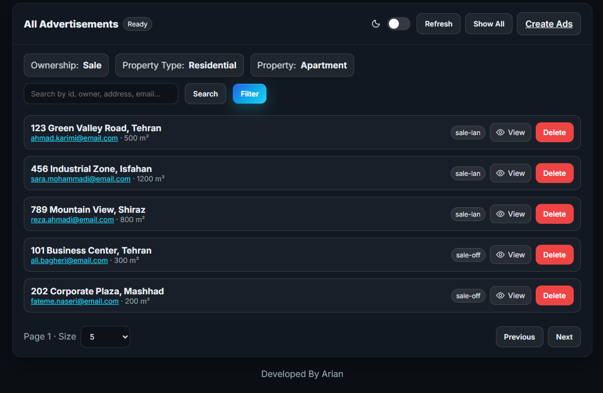

# UI Screenshots Gallery

Welcome to the UI Screenshots Gallery! This folder contains visual documentation of the Real Estate Advertisement System's user interface, showcasing the various screens and features available to users.

## 📸 Screenshot Overview

### 🖼️ Main Dashboard

**Description:** The main dashboard serves as the central hub of the application, providing users with a comprehensive view of all available properties, search functionality, and easy navigation to all major features.

**Key Features:**
- Property overview with search bar
- Navigation menu
- Responsive design optimized for all devices
- Clean, modern interface

---

### 🌓 Theme Support

#### Light Theme Dashboard

**Description:** The light theme provides a clean, professional appearance with optimal readability and a traditional color scheme.

**Features:**
- White background for maximum contrast
- Subtle shadows and borders
- Professional color palette
- High accessibility standards

#### Dark Theme Dashboard

**Description:** The dark theme offers a modern, eye-friendly interface that reduces eye strain and provides a contemporary aesthetic.

**Features:**
- Dark background to reduce eye strain
- Accent colors that pop against dark background
- Consistent contrast ratios
- Modern, sleek appearance

---

### 🔍 Advanced Filtering Interface

**Description:** The advanced filtering system allows users to narrow down property searches using multiple criteria simultaneously.

**Filtering Options:**
- **Property Type:** Land, Office, Shop, Villa, Apartment
- **Transaction Type:** Sale or Rent
- **Price Range:** Minimum and maximum price sliders
- **Location:** Area-based filtering
- **Size Range:** Property size in square meters
- **Real-time Results:** Instant filtering feedback

---

### ➕ Property Creation Dashboard

#### Light Theme

#### Dark Theme

**Description:** The property creation dashboard provides a comprehensive form for adding new properties to the system.

**Form Features:**
- Complete property information fields
- Real-time input validation
- Property type selection dropdown
- Sale/Rent transaction type toggle
- Image upload capability
- Auto-save functionality
- Error handling and user feedback

---

### 📄 Pagination System

**Description:** The pagination system ensures efficient data loading and smooth navigation through large property datasets.

**Pagination Features:**
- Configurable items per page
- Previous/Next navigation buttons
- Page number indicators
- Performance optimization for large datasets
- Smooth user experience

---

### 🎛️ Property Selector Component

**Description:** The property selector provides an intuitive dropdown interface for selecting property types and categories.

**Selector Features:**
- Dropdown interface with search capability
- Categorized property options
- Visual indicators for different types
- Responsive design for all screen sizes
- Quick find functionality

---

## 🎨 Design Philosophy

### Material-UI Integration
The application utilizes Material-UI components to ensure:
- **Consistency:** Uniform design language across all components
- **Accessibility:** WCAG compliant contrast ratios and keyboard navigation
- **Responsiveness:** Mobile-first design approach
- **Modern Aesthetics:** Clean, professional appearance

### Color Schemes
- **Light Theme:** Professional white background with subtle shadows
- **Dark Theme:** Modern dark interface with accent colors
- **Consistent Branding:** Unified color palette throughout

### Typography
- **Clear Hierarchy:** Proper font sizing and weight distribution
- **Readability:** High contrast text for optimal reading experience
- **Professional Fonts:** Modern, clean typography choices

## 📱 Responsive Design

The application is fully optimized for:
- **Mobile Devices:** Touch-friendly interface with large touch targets
- **Tablets:** Enhanced layout for medium-sized screens
- **Desktop:** Full-featured interface with advanced capabilities
- **All Browsers:** Cross-browser compatibility

## 🚀 User Experience Highlights

1. **Intuitive Navigation:** Easy-to-understand menu structure
2. **Real-time Search:** Instant results as you type
3. **Smart Filtering:** Advanced filters with visual feedback
4. **Theme Switching:** Seamless transition between light and dark modes
5. **Responsive Layout:** Consistent experience across all devices
6. **Error Handling:** Clear error messages and validation feedback
7. **Loading States:** Visual feedback during data operations
8. **Form Validation:** Real-time validation with helpful tips

## 📊 Property Management Features

### Supported Property Types
- **Land:** Residential and commercial land
- **Office:** Commercial office spaces
- **Shop:** Retail and commercial shops
- **Villa:** Residential villas
- **Apartment:** Residential apartments

### Transaction Types
- **Sale:** Properties available for purchase
- **Rent:** Properties available for rental

## 🔧 Technical Implementation

### Frontend Technologies
- **React.js:** Modern component-based architecture
- **Material-UI:** Professional component library
- **Responsive Design:** Mobile-first approach
- **State Management:** Efficient data handling

### Performance Optimizations
- **Lazy Loading:** Efficient image and component loading
- **Pagination:** Optimized data display
- **Caching:** Smart data caching strategies
- **Compression:** Optimized asset delivery

---

## 📝 Usage Notes

- **Browser Compatibility:** Works on all modern browsers
- **Device Support:** Optimized for desktop, tablet, and mobile
- **Accessibility:** WCAG 2.1 AA compliant
- **Performance:** Fast loading times and smooth interactions

---

*This UI gallery showcases the modern, user-friendly interface of the Real Estate Advertisement System, designed to provide an excellent user experience across all devices and preferences.*

**📁 [Back to Main README](../README.md)**
